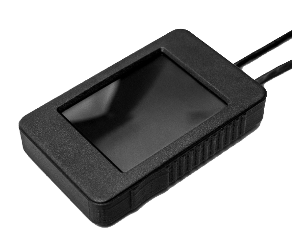

# SF30/D altimeter display

The SF30/D display unit is designed as an accessory for the SF30/D. This display allows for simple mounting and
readout of the distance detected by the SF30/D.

Please see the LightWare_SF30D altimeter guide.pdf file for more information.